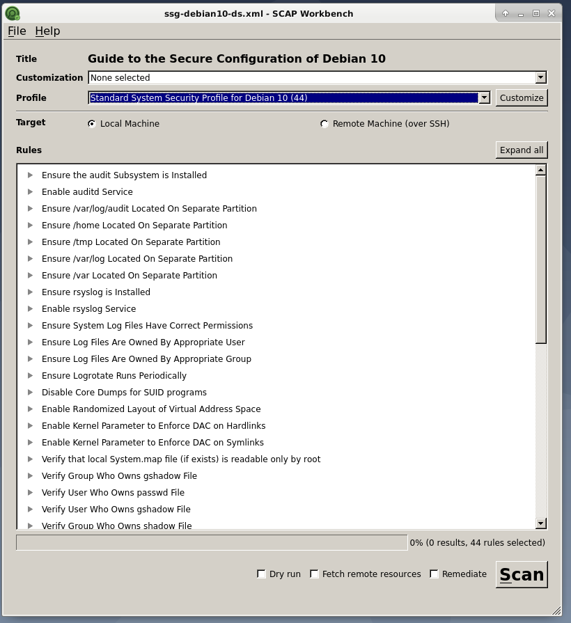
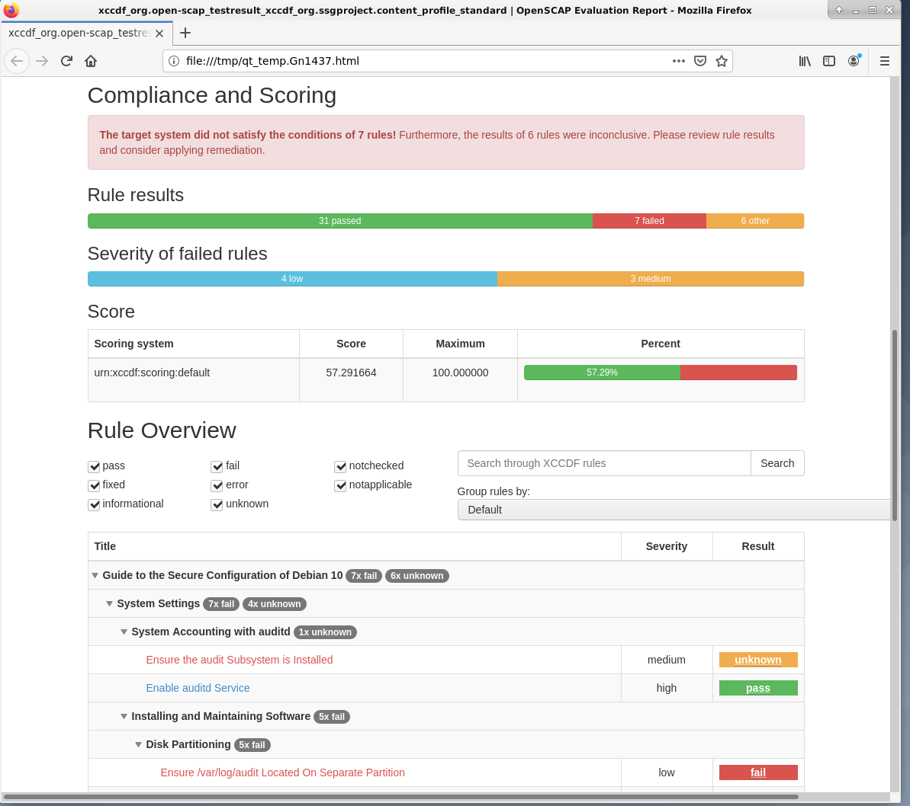

# SCAP Security and Compliance Scanning 

**Open-Source Content**

Security profiles available here are generated from OpenSCAP without warranty.

More information available publicly at: https://www.open-scap.org/tools/

**Usage Example with SCAP Workbench**

Step 1) Download SCAP workbench from the package manager within your distribution of Linux.

```bash
Debian:~$ apt-get install scap-workbench
Red_Hat:~$ yum install scap-workbench
Fedora:~$ dnf install scap-workbench
```
Step 2) Download the raw SCAP Security Guide xml file from this repo for the OS.

```bash
wget https://raw.githubusercontent.com/JCam6/DefensiveSecurity/main/SCAP_Scanner/ssg-debian10-ds-1.2.xml
```
Step 3) Start SCAP Workbench from the command line with the downloaded guide.

```bash
scap-workbench ssg-debian10-ds-1.2.xml
```

Step 4) Choose the profile to scan (i.e. level or security benchmark) and select scan. Authenticate if required. :point_down:



Step 5) Close the diagnostic window and select show report. Review the compliance score and suggested steps for remediation. :point_down:


